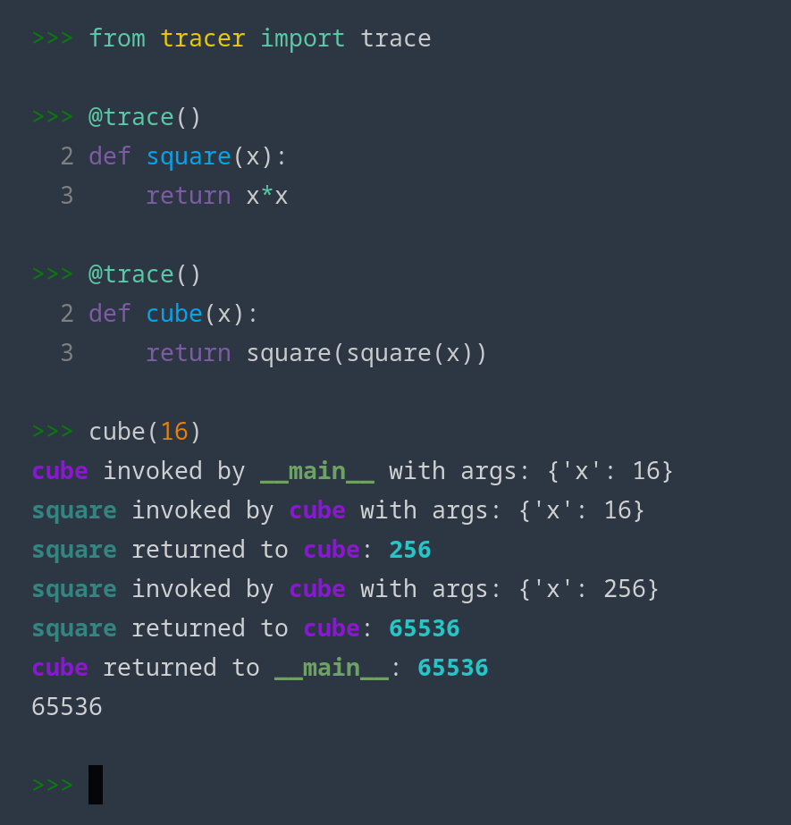

# tracer

a useful little decorator for tracing function calls at runtime. at the moment everything is printed to stdout, there's no logging handler for, say, redirecting the output to a file. it would be straightforward to replace its `print` calls with something else, though.

## install

Just run:

```
poetry install
```

## example
